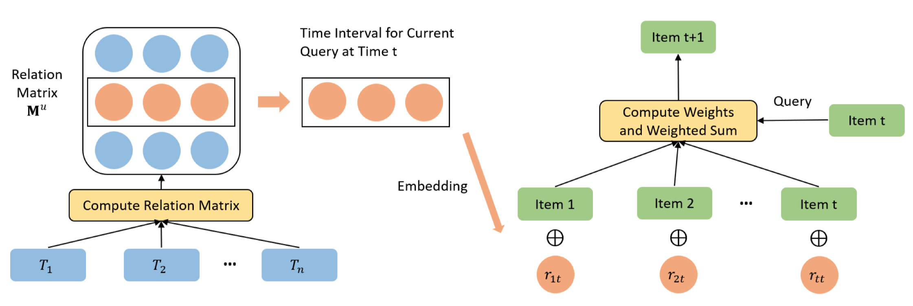
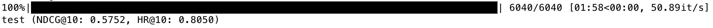

# TiSASRec.paddle
A PaddlePaddle implementation of Time Interval Aware Self-Attentive Sequential Recommendation.

## Introduction



论文：[Time Interval Aware Self-Attentive Sequential Recommendation](https://cseweb.ucsd.edu/~jmcauley/pdfs/wsdm20b.pdf)

## Results

| Datasets     | Metrics | Paper's | Ours   | abs. improv. |
| ------------ | ------- | ------- | ------ | ------------ |
| MovieLens-1m | HIT@10  | 0.8038  | 0.8050 | 0.0022       |
| MovieLens-1m | NDCG@10 | 0.5706  | 0.5752 | 0.0046       |

## Requirement

- Python >= 3
- PaddlePaddle >= 2.0.0
- see `requirements.txt`

## Dataset
MovieLens-1m (max_len = 50)

## Usage

### Train

```shell
bash ./script/train.sh
```

模型在 200 epochs 左右收敛，日志见 [nohup.out](./ml-1m_default/nohup.out)。

### Test

```shell
bash ./script/eval.sh
```

可以得到如下结果：




## References

```
@inproceedings{li2020time,
  title={Time Interval Aware Self-Attention for Sequential Recommendation},
  author={Li, Jiacheng and Wang, Yujie and McAuley, Julian},
  booktitle={Proceedings of the 13th International Conference on Web Search and Data Mining},
  pages={322--330},
  year={2020}
}
```

* https://github.com/JiachengLi1995/TiSASRec
* https://github.com/pmixer/TiSASRec.pytorch
* https://github.com/paddorch/SASRec.paddle